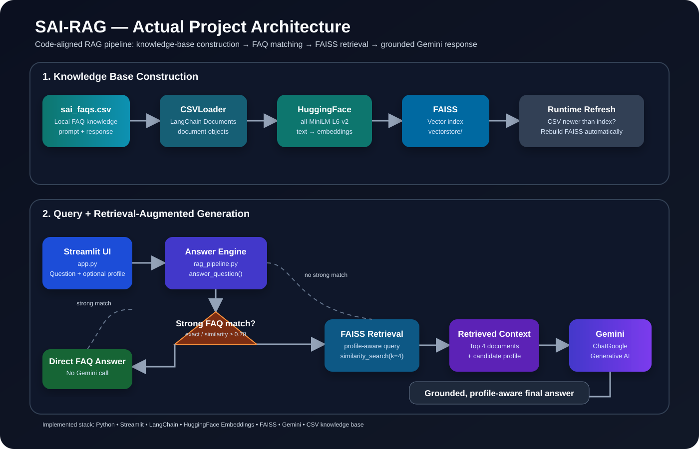

# SAI-RAG 🧠

> **RAG-powered Course, Career & Technology Advisor**

SAI-RAG is a Python + Streamlit **Retrieval-Augmented Generation (RAG)** application. It combines a local FAQ knowledge base, sentence-transformer embeddings, FAISS similarity search, LangChain components, and Gemini.

The main engineering focus is the **RAG pipeline**. Course, career, technology, and project guidance are use cases built on top of it.

### Visual architecture



The diagram below is the visual version of the execution flow implemented by the current code.

---

## 🚀 What the current code actually does

SAI-RAG has **two answer paths**:

1. **Strong FAQ match:** a close match in the CSV can be answered directly without calling Gemini.
2. **RAG + Gemini:** otherwise, the application retrieves the top **4** similar documents from FAISS, builds a grounded prompt, and sends it to Gemini.

### Complete execution architecture

```text
                         USER
                           │
              Question + Optional Profile
                           │
                           ▼
                    ┌─────────────┐
                    │   app.py    │
                    │  Streamlit  │
                    └──────┬──────┘
                           │
                    answer_question()
                           │
                           ▼
                 ┌──────────────────┐
                 │ rag_pipeline.py  │
                 │   Answer Engine  │
                 └────────┬─────────┘
                          │
                ┌─────────┴─────────┐
                │                   │
                ▼                   ▼
          Strong FAQ Match?      No strong match
                │                   │
                ▼                   ▼
         Direct FAQ Answer     Load FAISS
         (No Gemini call)          │
                                   ▼
                          similarity_search(k=4)
                                   │
                                   ▼
                          Retrieved Documents
                                   │
                                   ▼
                          Grounded Prompt
                                   │
                                   ▼
                              Gemini LLM
                                   │
                                   ▼
                            Final Response
                                   │
                                   ▼
                             Streamlit UI
```

---

## 🏗️ Knowledge-base creation architecture

The **Create Knowledge Base** button calls `build_vector_store()` from `create_vector_db.py`.

```text
data/sai_faqs.csv
       │
       ▼
   CSVLoader
       │
       ▼
LangChain Documents
       │
       ▼
HuggingFaceEmbeddings
(all-MiniLM-L6-v2)
       │
       ▼
   Text Vectors
       │
       ▼
FAISS.from_documents()
       │
       ▼
   vectorstore/
```

The CSV `prompt` column is used as the `source_column` by `CSVLoader`.

---

## 🔎 Actual question-processing flow

```text
User Question
      │
      ▼
answer_question()
      │
      ▼
_direct_faq_answer()
      │
      ├── Strong match ─────► Return stored FAQ answer
      │                        (Gemini is not called)
      │
      └── No strong match
               │
               ▼
        Load FAISS vector store
               │
               ▼
     Add Candidate Profile if provided
               │
               ▼
      similarity_search(k=4)
               │
               ▼
       Top 4 relevant documents
               │
               ▼
       Build retrieved context
               │
               ▼
        Build grounded prompt
               │
               ▼
             Gemini
               │
               ▼
          Final answer
               │
               ▼
        Answer + source context
               │
               ▼
          Streamlit UI
```

---

## 🧠 Direct FAQ matching

Before FAISS/Gemini, the code checks the CSV directly.

```text
Question
   │
   ▼
Normalize text
   │
   ▼
Compare against FAQ prompts
   │
   ├── Exact match ─────────► Direct answer
   │
   └── Similarity scoring
            │
            ▼
       Score >= 0.78?
         │       │
        Yes      No
         │       │
         ▼       ▼
   Direct answer  RAG pipeline
```

The matching logic uses text normalization, `SequenceMatcher`, word overlap, and a **0.78** strong-match threshold.

---

## 👤 Candidate Profile flow

The sidebar accepts an optional profile such as:

> MCA fresher | Python, SQL, JavaScript | interested in cybersecurity | entry-level roles

The profile is added to the retrieval query and also included in the Gemini prompt.

```text
Question + Candidate Profile
             │
             ▼
       Retrieval Query
             │
             ▼
      FAISS similarity search
             │
             ▼
       Retrieved Context
             │
             ├──────────────┐
             ▼              ▼
        Gemini Prompt   User Question
             │              │
             └──────┬───────┘
                    ▼
             Profile-aware Answer
```

The profile is additional context. It does not replace the knowledge base.

---

## ⚙️ What `rag_pipeline.py` actually contains

```text
rag_pipeline.py
      │
      ├── FAQ CSV loading
      ├── Text normalization
      ├── Direct FAQ matching
      ├── FAQ similarity scoring
      ├── FAISS loading
      ├── Semantic retrieval
      ├── Candidate-profile handling
      ├── Prompt construction
      ├── Gemini invocation
      ├── Retrieved-source return
      └── Streamlit caching
```

The current retrieval call is:

```python
vectorstore.similarity_search(retrieval_query, k=4)
```

So the current implementation retrieves **four documents**.

---

## 🔬 Gemini generation

When generation is required, the prompt contains:

```text
Candidate Profile
       +
Retrieved Knowledge-Base Context
       +
User Question
       +
Grounding Instructions
       │
       ▼
     Gemini
       │
       ▼
Generated Answer
```

The prompt instructs Gemini to use the supplied knowledge-base context for factual claims and avoid inventing unsupported prices, discounts, certificates, placement guarantees, salaries, dates, links, or policies.

---

## 🔄 Automatic FAISS refresh

The current code checks whether the FAQ CSV is newer than the FAISS index.

```text
Load vector store
       │
       ▼
Compare file modification times
       │
       ├── FAQ CSV newer ──► Rebuild FAISS
       │
       └── Index current ──► Load existing FAISS
```

---

## ⚡ Caching

The code uses Streamlit caching for reusable resources:

```text
Embeddings       → @st.cache_resource
FAQ rows         → @st.cache_data
FAISS store      → @st.cache_resource
Gemini client    → @st.cache_resource
```

`clear_rag_cache()` is called after creating the knowledge base so updated data can be used.

---

## 🧩 Technology Stack — as implemented

| Layer | Technology | Actual use |
|---|---|---|
| UI | **Streamlit** | Interface, sidebar, form, answers |
| Language | **Python** | Application logic |
| Knowledge source | **CSV** | FAQ knowledge base |
| Loader | **LangChain CSVLoader** | CSV → documents |
| Embeddings | **HuggingFaceEmbeddings** | Text → vectors |
| Embedding model | **all-MiniLM-L6-v2** | Semantic representation |
| Vector search | **FAISS** | Similarity retrieval |
| Orchestration | **LangChain** | Retrieval and LLM components |
| LLM | **Gemini / ChatGoogleGenerativeAI** | Generated responses |
| Caching | **Streamlit cache** | Resource reuse |
| Deployment | **Streamlit Cloud** | Hosting |

---

## 📁 Project structure

```text
SAI-RAG/
│
├── app.py
│   └── Streamlit UI and user interaction
│
├── config.py
│   └── API key, model, embedding and path configuration
│
├── create_vector_db.py
│   └── CSV → Documents → Embeddings → FAISS
│
├── rag_pipeline.py
│   └── FAQ match → Retrieval → Prompt → Gemini
│
├── data/
│   └── sai_faqs.csv
│       └── RAG knowledge base
│
├── .streamlit/
│   └── config.toml
│       └── Streamlit configuration
│
├── requirements.txt
│   └── Python dependencies
│
├── runtime.txt
│   └── Python runtime
│
├── .env.example
│   └── Example environment variables
│
└── README.md
    └── Project documentation
```

---

## 🔬 File-by-file explanation

### `app.py`

The Streamlit front end. It currently provides Create Knowledge Base, FAISS readiness status, Candidate Profile input, the question form, Ask SAI-RAG, final answer display, and retrieved source-context display.

### `create_vector_db.py`

Builds the FAISS vector store:

```text
CSV → CSVLoader → Documents → Embeddings → FAISS → vectorstore/
```

### `rag_pipeline.py`

Runs the answer workflow:

```text
FAQ Match
   ↓
FAISS Retrieval
   ↓
Context
   ↓
Prompt
   ↓
Gemini
   ↓
Answer + Sources
```

### `config.py`

Centralizes the Gemini API key, Gemini model, embedding model, FAQ path, vector-store path, and application directories.

### `data/sai_faqs.csv`

The local knowledge base used for direct FAQ matching and vector retrieval.

---

## 🧪 Example: one real request

Question:
> **Which technology should I learn next?**

Profile:
> **MCA fresher | Python | SQL | interested in cybersecurity**

```text
Question + Profile
       │
       ▼
     app.py
       │
       ▼
answer_question()
       │
       ▼
FAQ match?
   │       │
  Yes      No
   │       │
   ▼       ▼
Answer   FAISS
           │
           ▼
         Top 4
           │
           ▼
     Retrieved Context
           │
           ▼
     Grounded Prompt
           │
           ▼
         Gemini
           │
           ▼
   Profile-aware Answer
```

---

## 🛡️ Grounded AI

The intended generation pattern is:

```text
Retrieve
   ↓
Ground the prompt with retrieved context
   ↓
Generate
```

The project does **not** claim that RAG completely eliminates hallucinations. It demonstrates how retrieval can provide the LLM with application-specific context.

If required course-specific or technology-specific information is not available, the prompt instructs the model to say:

> "I don't have that information in the current knowledge base."

---

## 🎯 What this project demonstrates

```text
Python + Streamlit
        ↓
Knowledge Base
        ↓
Document Loading
        ↓
Embeddings
        ↓
FAISS Vector Search
        ↓
RAG Retrieval
        ↓
Prompt Engineering
        ↓
Gemini LLM
        ↓
Grounded Response
        ↓
Profile-aware AI Use Case
```

This is the **AI engineering story** of SAI-RAG.

---

## 🆓 Free-only design

SAI-RAG is intentionally configured for a **free Gemini API path** where practical. The Gemini model selection is controlled in `config.py`.

> **Free does not mean unlimited.** API providers can still impose request, token, and quota limits.

---

## ☁️ Streamlit Cloud

### Entry point

```text
app.py
```

### Required secret

In **Streamlit Cloud → Settings → Secrets**:

```toml
GEMINI_API_KEY = "your_gemini_api_key"
```

### First run

```text
Deploy
  ↓
Open SAI-RAG
  ↓
Create Knowledge Base
  ↓
FAISS index
  ↓
Enter question
  ↓
Ask SAI-RAG
  ↓
Answer
```

---

## 💻 Run locally

```bash
git clone https://github.com/pallasivasai/SAI-RAG.git
cd SAI-RAG
pip install -r requirements.txt
streamlit run app.py
```

Set `GEMINI_API_KEY` before running.

---

## 🧭 Future AI-engineering direction

These are **not current features**; they are possible next steps:

- PDF/document ingestion
- website ingestion
- richer source citations
- conversation memory
- hybrid retrieval
- reranking
- query classification
- RAG evaluation
- retrieval-quality metrics
- advanced chunking
- AI-generated project roadmaps

---

## 📌 Interview explanation

> **"I built a Python and Streamlit-based Retrieval-Augmented Generation application. It loads a custom CSV knowledge base, converts documents into embeddings using Sentence Transformers, stores them in FAISS, retrieves the top relevant documents for a query, and passes the retrieved context to Gemini for grounded response generation. I also implemented deterministic FAQ matching to avoid unnecessary LLM calls, candidate-profile-aware retrieval and prompting, caching, and automatic vector-store refresh when the knowledge base changes."**

This description is aligned with the **current repository code**.

---

## 📚 Attribution

This repository is an independent implementation inspired by the general RAG workflow demonstrated in the Codebasics LangChain project.

It does **not** redistribute the original project's code, FAQ dataset, notebook, or image verbatim.

---

## 👨‍💻 Author

**P Siva Sai**

GitHub: https://github.com/pallasivasai

Project: https://github.com/pallasivasai/SAI-RAG
